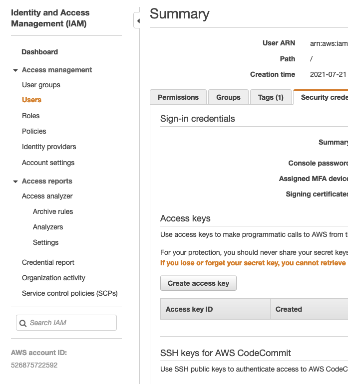
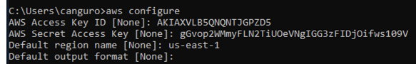

# **Desplegando aplicaciones desarrolladas con GeneXus en ambientes Serverless**

Por: [Gerardo Canedo](https://github.com/gerardocanedo). 
Colaboradores: [Matias Maldonado](https://github.com/mmaldonado56) y [Nicolás Cheda](https://github.com/ncheda).


## **Introducción**

Hace poco me solicitaron ayuda para desplegar una aplicación construida de forma honoraria para una ONG. Para que esta aplicación sea realmente de utilidad, debe encontrarse en producción, y para esto me solicitaron ayuda. 

Un aspecto nada menor al desplegar un sistema en producción es la administración. Luego de desplegado, no termina allí el trabajo. Una serie de tareas deben ser realizadas periódicamente, además de las urgencias (que suelen ser los sábados de noche) que eventualmente surgen. Caídas del sistema, gestión de certificados, actualización de software base, problemas de conectividad, rotación de logs y otros tantos más son comunes en la operación de un sistema.

En otro proyecto utilizamos el servicio Lambda en la nube de Amazon (AWS) para auto escalar en ciertos picos de demanda, y funcionó muy bien. En este caso, en vez de escalar, me atrae mucho la idea de pagar por lo que se utiliza. Esta aplicación no se utilizará masivamente, y si su ejecución genera poco gasto para la ONG, es un punto a favor.

Además de Lambda, AWS posee el servicio Fargate: una solución para ejecutar contenedores Docker sin servidor de base (serverless). Como necesito manejar la sesión de los usuarios para esta aplicación web, Fargate es la pieza de construcción correcta.

En este post contaré mi experiencia desplegando una aplicación web desarrollada con GeneXus (generador Java) y utilizando como DMBS PostgresSQL.

## **Objetivos**

Los objetivos perseguidos son los siguientes:

1. Minimizar la necesidad de ejecutar tareas manuales durante la operación del sistema.
2. Realizar un despliegue seguro:  Cumplir con el nivel 1 de los requerimientos del OWASP ASVS, en particular en los puntos V9 (Verificación de requerimientos de comunicación) y V14 (Verificación de requerimientos de configuración).
3. Obtener experiencia en infraestructura como código. Utilizando el cloud development kit (CDK) de Amazon, generar la infraestructura y todo activo posible de forma programática (no utilizar el sitio de AWS para configurar el despliegue). El objetivo secundario es poder generar distintos ambientes del ciclo de desarrollo de forma automática y reutilizar el conocimiento para otros proyectos.
4. Minimizar los costos de operación. De cobrarse la infraestructura en función a su uso, el costo debería de ser bajo.
5. El usuario final debe de poder acceder a una URL dentro del propio dominio de la organización. El despliegue debe ubicarse en una URL del estilo `https://sistema.dominio.com`. No es aceptable poseer una URL generada por la nube y para nada amistosa para un usuario final.
6. Generar experiencia en el despliegue de aplicaciones web generadas con GeneXus en contextos serverless en la nube.

## **Diagrama de la solución**

```
(VPC)
                        ECRRegistry
                            |
                            |
                            |
        Usuario → ECS Cluster (Fargate) → Database (RDS)
                   \    /         |
                    \  /          |
                     DNS   AWS Certificate Manager
```

**VPC (Virtual Private Cloud):** Amazon Virtual Private Cloud ([Amazon VPC](https://docs.aws.amazon.com/es_es/vpc/latest/userguide/what-is-amazon-vpc.html)) le permite lanzar recursos de AWS en una red virtual que haya definido. Esta red virtual es muy similar a la red tradicional que usaría en su propio centro de datos, pero con los beneficios que supone utilizar la infraestructura escalable de AWS.

**ECS Cluster (Fargate):** [AWS Fargate](https://aws.amazon.com/es/fargate/) es "un motor informático sin servidor que funciona tanto con Amazon Elastic Container Service (ECS). Permite desplegar contenedores y gestionarlos sin tener que configurar o administrar la infraestructura base.

**ECR:** [AWS Elastic Container Registry](https://aws.amazon.com/es/ecr/)  es un registro de imágenes de contenedores. En este caso de uso en particular, se utiliza para publicar desde el ambiente de desarrollo las imágenes Docker generadas con la aplicación web y consumirla desde la nube. Este registro es de uso privado de este despliegue.

**Database (RDS):** [RDS](https://aws.amazon.com/es/rds/) es el componente de la nube de AWS que implementa la gestión, aprovisionamiento y configuración de instancias de bases de datos. Permite contar con una instancia de base de datos sin la necesidad de poseer conocimiento para configurarla.

**AWS Certificate Manager**: es el servicio de AWS que permite emitir y gestionar certificados digitales. Algo importante en este caso es que el dominio en cuestión ya existe de antemano y no fue migrado a la nube AWS.

**DNS:** DNS previamente existente. 

**Usuarios:** Usuarios de la aplicación.

## **Prerrequisitos**

Antes de comenzar la implementación debemos contar con:

1. Una cuenta de AWS y un usuario del tipo IAM.
2. Una definición de una imagen Docker.

## **Setup**

Para realizar el despliegue de la infraestructura es necesario realizar la instalación del Cloud Development [CDK](https://aws.amazon.com/es/cdk/)  Kit de AWS. CDK es un framework multi lenguaje. En este caso decidí utilizar Java.

Software base requerido en el ambiente de desarrollo

* JDK de Java.
* IDE de desarrollo Java (Visual Studio Code en mi caso).
* Maven.
* Node js: CDK lo requiere.

Ejecutar los siguientes comandos:

```bash
npm install -g aws-cdk
```

Para verificar que quedó instalado correctamente, ejecutar:

```bash
aws configure
```

Para autenticar al cli contra AWS, se debe ejecutar el siguiente comando, indicando Access Key, Secret Access Key y región.

```bash
cdk --version
```

Para crear un proyecto nuevo es posible realizarlo como lo indica la documentación:

```bash
mkdir hello-cdk
cd hello-cdk
cdk init app --language java
```

En este caso, no es necesario inicializar una aplicación, ya que el código fuente ya está desarrollado. Se puede descargar desde **[aquí](https://github.com/GenexusConsulting/GeneXusAWSDemo)**.


## **Infraestructura como código**

### **VPC y Usuario de la infraestructura**

Para alojar la infraestructura es necesario crear un VPC (Virtual Private Cloud), la cual conforma la base de todos los demás recursos que pueden ser implementados en nuestra infraestructura. La VPC puede contener tanto redes públicas como privadas según se dispongan o no de "Internet Gateways". 

Por otra parte, para realizar las tareas operativas de este proyecto en particular, se crea un usuario al cual se le otorgarán los permisos suficientes para su correcta operación.

```java
   super(scope, id, props);
   // Virtual Private Cloud Creation
   vpc = Vpc.Builder.create(this, project + "_vpc")
       .cidr("192.168.0.0/16")
       .maxAzs(2) // Amazon RDS needs at least 2 AZs
       .subnetConfiguration(subnetConfigurations())
       .build();

   // User for Docker registry and ECR management
   // Passwordless, an authorization token must be issued manually
   // to be used by CDK
   String ecrUser = project + "_ecr";
   user = User.Builder.create(this,ecrUser).userName(ecrUser).build();
```

### **Registro de Contenedores**

El registro de contenedores es el componente en el que se almacenan las imágenes que luego se utilizarán desde el motor serverless.

En este caso, se crea un repositorio ECR con el nombre del proyecto y se le permite acceder al usuario creado previamente.

También se crea una política de limpieza de imágenes. Como vamos a estar subiendo imágenes continuamente y estas imágenes pueden ser reconstruidas en el consolidado de desarrollo, se minimiza la cantidad almacenada. 

```java
   Repository repository =  Repository.Builder.create(this, project + "_repository")
       .repositoryName(project)
       .imageScanOnPush(false)
       .removalPolicy(RemovalPolicy.DESTROY)
       .build();

   // Grant permissions to user to push and pull images.
   repository.grantPullPush(user);

   // Up to 5 images
   LifecycleRule lifecycleRule = LifecycleRule.builder()
       .maxImageCount(5)
       .build();
   repository.addLifecycleRule(lifecycleRule);
```

### **Base de Datos**

La base de datos es creada dentro del servicio RDS de AWS.

Un punto interesante es la forma de gestionar el password de la base de datos, la cual consiste en que AWS hace uso del concepto de Secreto para el manejo de los permisos de acceso. Este secreto puede ser generado y almacenado por la propia plataforma, pudiendo ser configurada tanto en la base de datos como en el servidor de aplicación web, sin que ninguna persona intervenga.

En la práctica, para realizar la administración del DBMS es práctico poseer un usuario de base de datos. Es posible configurar una VPN para acceder al VPC sin exponer el servicio a Internet.

```java
secret = Secret.Builder.create(this, project + "_secret")
           .secretName(project + "_secret")
           .description("Database Password for "+ project)
           .generateSecretString(getDatabaseSecretStringGenerator4GeneXus())
           .build();
```

```java
   private SecretStringGenerator getDatabaseSecretStringGenerator4GeneXus() {
       return SecretStringGenerator.builder()
              .excludePunctuation(true).includeSpace(false).build();
   }
```

Utilizar un Secreto del tipo DatabaseSecret no resulta práctico en este caso, ya que utiliza su propio formato de JSON. En aplicaciones GeneXus, existe un mecanismo para indicar los _connections strings_ a través de variables de entorno con nombres conocidos.

Con el siguiente código, se genera una base de datos PostgreSQL:	

```java
database =  DatabaseInstance.Builder.create(this, project + "_database_postgres")
   .instanceIdentifier(project + "-database-postgres")
   .databaseName(project)
   .credentials(Credentials.fromPassword(contexto.getDB_USER_ID(),
         secret.getSecretValue()))
   .engine(DatabaseInstanceEngine.postgres(getpostgresInstanceEngineProps()))
   .vpc(vpc)
   .instanceType(InstanceType.of(InstanceClass.BURSTABLE3, InstanceSize.MICRO))
   .removalPolicy(RemovalPolicy.DESTROY)
   .deletionProtection(false)
   .securityGroups(Arrays.asList(securityGroup))
   .vpcSubnets(SubnetSelection.builder().subnetType(SubnetType.PUBLIC).build())
   .autoMinorVersionUpgrade(true)
   .backupRetention(software.amazon.awscdk.core.Duration.days(0))
   .build();
```

### **Certificado Digital y DNS**

Desplegar la aplicación web de forma correcta implica, entre otras cosas, desplegarla utilizando canales de transporte seguros a nivel de la capa de transporte. En la práctica, es utilizar HTTPS con una configuración correcta del conjunto de cifradores y de los certificados electrónicos utilizados para identificar el servicio.

Para esto, es necesario poseer un nombre de dominio.

En caso de no poseerlo, se puede adquirir a través de la propia nube de AWS y configurarlo en la infraestructura de forma muy sencilla. El componente de AWS que brinda este servicio es denominado [Route53](https://aws.amazon.com/es/route53/).

Para este caso,  asumimos el uso de un DNS ya existente y externo a AWS. A través del [Certificate Manager](https://aws.amazon.com/es/certificate-manager/), es posible emitir certificados para dominios que poseemos. Para esto es requerido realizar un paso manual que consta en generar un registro CNAME con un nombre y un valor generados por la propia plataforma. Si se ha generado dicho registro, Certificate Manager entiende que quien ha solicitado la creación del certificado posee autorización sobre el dominio. A partir de ese momento, generará certificados para el dominio en cuestión sin mayores restricciones. 

Realizar la creación de certificados a través de CDK se muestra en el siguiente código:

```java
Certificate certificate = Certificate.Builder.create(this, project + "_certificate")
    .domainName("coolapp.example.com")
    .validation(CertificateValidation.fromDns())
    .build();  

```

Luego de la puesta en funcionamiento del motor serverless será necesario generar el correspondiente registro de DNS. 

### **Despliegue de la aplicación web**

Utilizar un ambiente serverless tiene como grandes ventajas no requerir la instalación de un servidor web dedicado ni su administración. A su vez, es capaz de detectar si la aplicación web es actualizada y desplegar la nueva versión, así como detectar si no se encuentra operativa y reiniciarla.

#### <span style="text-decoration:underline;"> Creación de la imagen de Docker </span>

La forma de utilizar nuestra aplicación web en este contexto es a través de una imagen Docker. Esta imagen puede ser basada en una pública, en una privada o modificando una existente.

Para esto, en nuestro equipo donde generamos la aplicación GeneXus (comúnmente denominado consolidado o build server), debemos poseer la capacidad de generar imágenes Docker. La forma más sencilla es instalar Docker Desktop ([https://hub.docker.com/editions/community/docker-ce-desktop-windows](https://hub.docker.com/editions/community/docker-ce-desktop-windows)).  


Un posible archivo Dockerfile es el siguiente (utilizando tomcat 9 y jdk 11 con una imagen generada con GeneXus en mente):

```Dockerfile
FROM gerardocanedo/tomcat9_jdk11_for_genexus

COPY your-warfile.war ./webapps/ROOT.war
```

Ejecutando el siguiente comando, se construye la imagen. 

```bash
# Creo la nueva imagen Docker local
docker build -t image-name .
```

Es importante notar que es posible ejecutarla de forma local con el fin de validar su correctitud.


#### <span style="text-decoration:underline;">Creación de la infraestructura serverless básica: Repositorio ECR y base de datos RDS</span>

Previo a poder poner en funcionamiento nuestra aplicación a través del ECS Fargate, necesitamos disponer del Repositorio de imágenes con la imagen base desde la cual se generarán los contenedores deseados, y también se deberá haber creado la base de datos de la aplicación en el servicio RDS a desplegar.

Es por ello que se deberá efectuar la ejecución de los Stacks contenidos en nuestra aplicación que crean:

1. Repositorio ECR.
2. Instancia RDS.

Para ello se deberá ejecutar el CDK:

```
C:\cdk-demoGX>cdk deploy CdkDemoGXDockerRegistryStack CdkDemoGXDatabaseStack
```

Posteriormente a través de la consola web de AWS, ya estamos en condiciones de cargar la estructura de la base de datos y la imagen del contenedor.

#### <span style="text-decoration:underline;">Cargar las estructuras de la base de datos</span>

Para acceder a la instancia RDS de la base de datos creada, utilizaremos las credenciales del usuario que se haya definido en el CDK y como password se tendrá que obtener el "Secreto" creado por nuestro Stack en AWS. La URL de acceso podrá ser obtenida desde el servicio RDS ("Punto de enlace y puerto").

#### <span style="text-decoration:underline;">Carga de la imagen a Amazon</span>

El siguiente paso es publicar esta imagen en el registro privado del usuario de Amazon, así se encontrará disponible su instanciación en el ambiente serverless.

Para interactuar con AWS es necesario instalar el las herramientas de línea de comando de AWS en su versión 2 ([https://awscli.amazonaws.com/AWSCLIV2.msi](https://awscli.amazonaws.com/AWSCLIV2.msi)) en el consolidado.


Luego de instaladas, es preciso autenticarse para que AWS acepte el push de nuestra imagen. Esto no se realiza con usuario y password y de forma interactiva, sino a través de la emisión de un token de acceso para un usuario autenticado (el usuario creado en el Stack de nuestra aplicación).


Esto se debe hacer a través de la consola de AWS y debe actualizarse en caso de que el token sea invalidado.



Habiendo generado el token, con el comando `aws configure` es posible indicarle a la línea de comando de AWS las credenciales a utilizar.



Una nota no menor es que las claves que se muestran en la imagen anterior ya fueron desactivadas luego de tomar la captura.


Con la imagen construida y el token generado, es momento de realizar el Push de la imagen. Para esto la marcamos como la última (*latest*) y la subimos.


```bash
# Login en el ECR, usando el token
aws ecr get-login-password --region us-east-1 | docker login --username AWS --password-stdin AWS-ID.dkr.ecr.us-east-1.amazonaws.com

# Retag de la imagen para ser subida al repositorio creado en AWS
docker tag image-name:latest AWS-ID.dkr.ecr.us-east-1.amazonaws.com/project-name:latest

# Carga de la imagen al repositorio en AWS
docker push AWS-ID.dkr.ecr.us-east-1.amazonaws.com/project-name:latest
```

#### <span style="text-decoration:underline;">Creación del servicio Fargate (serverless)</span>

Para la ejecución de la imagen Docker, es preciso desplegar un cluster con un balanceador de carga en AWS Fargate. Afortunadamente es más difícil explicarlo que hacerlo:

```java
ApplicationLoadBalancedFargateService applicationLoadBalancedFargateService =
   ApplicationLoadBalancedFargateService.Builder.create(this, project +"_service")
   .cluster(cluster)
   .desiredCount(1)
   .taskImageOptions(
       ApplicationLoadBalancedTaskImageOptions.builder()
           .image(ContainerImage.fromEcrRepository(repository))
           .containerName(project + "_web_container")
           .secrets(secretos)
           .environment(ambiente)
           .taskRole(ecsTaskExecutionRole)
           .executionRole(ecsTaskExecutionRole)
           .containerPort(8080)
           .logDriver(log)
           .build()
   )
   .cpu(256)
   .memoryLimitMiB(512)
   .publicLoadBalancer(true)
   .serviceName(project + "_service")
   .assignPublicIp(true)
   .listenerPort(443)
   .protocol(ApplicationProtocol.HTTPS)
   .certificate(certificate)
   .redirectHttp(true)
   .securityGroups(Arrays.asList(securityGroup))
   .recordType(ApplicationLoadBalancedServiceRecordType.ALIAS)
   .build();

applicationLoadBalancedFargateService.getTargetGroup().configureHealthCheck(HealthCheck.builder()
   .path("/app/servlet/com.agenda.login")
   .interval(Duration.seconds(60))
   .healthyThresholdCount(3)
   .timeout(Duration.seconds(15))
   .build()
   );
```

Al cluster se le indica el registro desde donde debe obtener la imagen, la cantidad de instancias a desplegar (1 en este caso), configuraciones para instanciar la imagen (variables de entorno y secretos, puerto a exponer y gestión de logs), CPU, memoria, puertos a exponer, protocolo, etc.

También es necesario especificar una URL para verificar la salud (Health Check) del sistema. Si el contenedor no responde de la forma especificada, Fargate detiene la tarea y genera una nueva.

#### <span style="text-decoration:underline;">Secretos y variables de ambiente</span>

Para establecer la conexión a la base de datos, sin almacenar en las imágenes parámetros de conexión (JDBC Connection String), usuarios y passwords, es preciso utilizar los mecanismos provistos por la plataforma. Estos mecanismos son los secretos y las variables de ambiente.

Desde el punto de vista del contenedor, no existen diferencias entre los secretos y las variables de ambiente.  Las variables de ambiente pueden almacenarse directamente en el código fuente de la infraestructura (se puede visualizar con el comando `cdk synth`), mientras que los secretos son referenciados pero no incluidos. De hecho, nunca son extraídos de la nube de AWS. 

```java
// Password de la base de datos "GX_"
Map<String,Secret> secretos = new HashMap<String,Secret>();
secretos.put("com_app_DEFAULT_USER_PASSWORD",Secret.fromSecretsManager(secret));
secretos.put("com_app_GAM_USER_PASSWORD",Secret.fromSecretsManager(secret));

// Connection String, similar to
//  export GX_********_DEFAULT_USER_ID=*****
//  export GX_*****_DEFAULT_DB_URL=jdbc:postgresql://XX.XX.XX.XX:PORT/database
Map<String,String> ambiente = new HashMap<String, String>();
ambiente.put("com_app_DEFAULT_USER_ID", contexto.getDB_USER_ID());
ambiente.put("com_app_DEFAULT_DB_URL", contexto.getDB_URL());

ambiente.put("com_app_GAM_USER_ID", contexto.getDB_USER_ID());
ambiente.put("com_app_GAM_DB_URL", contexto.getDB_URL());
```

En el ejemplo anterior, la aplicación GeneXus posee como package _com.app _y utiliza dos datastores: Default y GAM. Para cada datastore, se especifica la URL de conexión, el usuario y password.

El password es obtenido del gestor de secretos de la plataforma, del mismo lugar donde se accede al crear la base de datos.

Desplegando este servicio, finalizamos de desplegar la infraestructura.


### **Ejecución**

En este punto es necesario proceder a la creación de la infraestructura serverless en AWS de acuerdo a los Stacks que se definieron para la aplicación CDK. Dicho proceso, a través de la etapa de "synthesize" generará a partir de la definición efectuada en código Java, los template CloudFormation en formato YAML que serán utilizados en AWS para crear la infraestructura definida. Para lo anterior se hace uso de la API definida con el comando `cdk`:

```
# Listar los Stacks presentes en el CDK
C:\cdk-demoGX>cdk ls
CdkDemoGXDockerRegistryStack
CdkDemoGXStack
CdkDemoGXDatabaseStack
CdkDemoGXECRStack

# Generar el template CloudFormation para la aplicación CDK
C:\cdk-demoGX>cdk synth
Successfully synthesized to C:\cdk-demoGX\cdk.out
Supply a stack id (CdkDemoGXDockerRegistryStack, CdkDemoGXStack, CdkDemoGXDatabaseStack, CdkDemoGXECRStack) to display its template.

# Ejecutar y crear el despliegue de la infraestructura serverless en AWS
C:\cdk-demoGX>cdk deploy
Since this app includes more than a single stack, specify which stacks to use (wildcards are supported) or specify `--all`
Stacks: CdkDemoGXDockerRegistryStack · CdkDemoGXStack · CdkDemoGXDatabaseStack · CdkDemoGXECRStack

# Borrar toda la infraestructura serverless en AWS para los stacks del CDK
C:\cdk-demoGX>cdk deploy --all
```

El siguiente paso es desplegar la imagen generada con Docker al repositorio de imágenes.

Para poder cargar la imagen, es requerido previamente haber configurado las credenciales a utilizar. Esto fue realizado en un paso anterior. 

Una vez creada y en funcionamiento de infraestructura, para automatizar la subida y actualización de la nueva imagen, es posible utilizar el siguiente script de PowerShell:

```bash
# Login para Docker con AWS
aws ecr get-login-password --region us-east-1 | docker login --username AWS --password-stdin AWS-ID.dkr.ecr.us-east-1.amazonaws.com/project-name

# Se marca como la última (es la que usamos para desplegar)
docker tag image-name:latest AWS-ID.dkr.ecr.us-east-1.amazonaws.com/project-name:latest

# Se envia al Registro de Amazon
docker push AWS-ID.dkr.ecr.us-east-1.amazonaws.com/project-name:latest

# Se actualiza el servicio para recargar la imagen
aws ecs update-service --cluster project-name_cluster --service project-name_service --force-new-deployment
```

En el código de referencia se deben reemplazar AWS-ID por el identificador de la cuenta de AWS y project-name por el nombre del proyecto en cuestión.

Luego de algunos minutos, la URL de la aplicación establecida en AWS Fargate y en el certificado se encontrará disponible:

https://coolapp.example.com/app/servlet/com.agenda.login


### **Logs**

Un aspecto fundamental para la administración de nuestras aplicaciones, es la capacidad de registrar y visualizar centralizadamente los logs generados durante la ejecución de la aplicación en el servicio ECS de AWS y para ello hacemos uso de servicio AWS CloudWatch que sirve para el monitoreo de nuestra aplicación. 

Para que el servicio Fargate efectúe el envío de logs hacia CloudWatch, necesitamos encender el driver "awslogs" y de esta manera sin necesidad de personalizar nada, la tarea creada en ECS efectuará todas las configuraciones por defecto y enviará los logs de nuestro contenedor a un "target group" de nuestro CloudWatch:

```java
// Tratamiento de logs en el contenedor y su persistencia por 6 meses.
LogDriver log = LogDriver.awsLogs(
            AwsLogDriverProps.builder()
            .logGroup(
                LogGroup.Builder.create(this, project)
                .retention(RetentionDays.SIX_MONTHS)
                .build())
            .streamPrefix(project)
            .build());
```

Se debe tener en cuenta para este caso, que la aplicación deberá encontrarse enviando registros de logs al standard output (stdout), para lo que será necesario tal vez configurar la aplicación (por ejemplo el framework Log4j).


### **Guía rápida:**

1. Crear y/o disponer del fuente CDK compuesto por los distintos Stacks que crearán la infraestructura deseada.
2. Ejecutar solo el CDK para generar la infraestructura requerida para:
    - Infraestructura que soporta la base de datos:
        - Requiere la ejecución solo del Stack correspondiente.
        - Hace uso del Servicio RDS.
        - El usuario es definido en el código fuente del Stack.
        - La contraseña y la URL de acceso a la misma se generan en tiempo de ejecución, en el Stack se hace referencia a través del "Secret" para la contraseña y el "DatabaseInstance" para la URL. En el caso del Secret, el mismo puede obtenerse por la interfaz web AWS en el servicio "Secrets Manager".
        - Con las credenciales y URL se hace manualmente la creación de la estructura de la base de datos.
    - Infraestructura que soporta el repositorio Docker:
        - Requiere la ejecución solo del Stack correspondiente.
        - Hace uso del servicio ECR.
        - El usuario es definido en el código fuente del Stack.
        - Como contraseña se utilizará un token que se creará interactivamente a través de la interfaz web de AWS para el usuario creado anteriormente.
3. Creación de imagen Docker conteniendo nuestra aplicación GX:
    - Deberá contener embebida la aplicación GX.
    - A través de las variables de entorno se podrá generar contenedores parametrizados de acuerdo al ambiente de despliegue (local, test, producción):
        - `"GX_" +databaseEnvironmentPrefix + "_"+ datasourcePrefix +"_USER_ID`
        - `"GX_" +databaseEnvironmentPrefix + "_"+ datasourcePrefix +"_USER_PASSWORD"`
        - `"GX_" +databaseEnvironmentPrefix + "_"+ datasourcePrefix +"_DB_URL"`
    - En el CDK se pueden hacer uso del "contexto" por medio del archivo `cdk.json` y definir allí, valores como por ejemplo: `"DATABASE_PREFIX_ENVIRONMENT": "COM_GXDEMO"`

        El contexto se puede verificar con `cdk context`.

4. Cargar imagen Docker al repositorio ECR:
    - Se requiere hacer login con aws-cli (`aws configure`) con el usuario definido en el CDK y un token creado manualmente para dicho usuario.
    - La URL del repositorio puede obtenerse del servicio ECR.
    - Cada repositorio mantiene versiones de una única imagen (distintos TAGs).
5. Finalmente ejecutar todos los stacks del CDK, lo que dará lugar a la creación de la infraestructura restante y final:
    - Servicio ECS: servicio de orquestación de contenedores.
    - Fargate Loadbalancer: servicio que soporta la ejecución del ECS en modalidad serverless (sin gestión de infraestructura) y con funcionalidad de balanceo de carga en cluster.